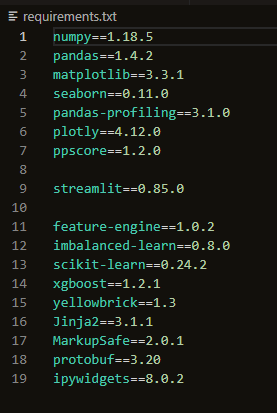
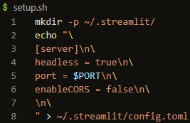
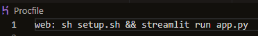
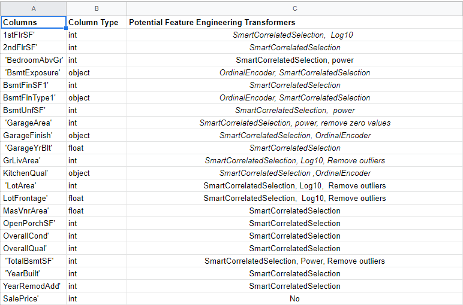

# Housing Heritage Issues.

### Predictive regression model for house sale prices in Ames, Iowa

  

- Intended Purpose of This Project:

- This machine learning project was undertaken for my fifth project with the Code Institute, which was part of the Predictive Analytics module. We were set the task of building an ML pipeline which would predict the sale price of 4 houses, which were inherited by a fictional indivdual called Lydia Doe, based on various factors such as overall quality, size in square feet, number of rooms, age of the property, and others (full dataset features below). The machine learning task was a regression task.

- The project followed the CRISP-DM workflow phases of: 
    - Business Understanding 
    - Data Understanding
    - Data Preparation
    - Modelling
    - Evaluation
    - Deployment

- The project had 2 business requirements:
    1. Carry out a correlation analyis to show which house attributes correlate with Sale Price.
    2. Deploy a pipeline to predict the sale price of Lydia's inherited houses.

- The regression model was evaluated using mainly the R2 score, which to satisfy the business requirements needed to have a value of 0.8 or above for both the Train and Test sets.

- The business requirements are satisfied by the Streamlit dashboard application which encompasses a page to view the correlation analysis, the predicted house values and the performance of the model.

## Table of contents
- <a href="#dc">Dataset Content</a>
- <a href="#br">Business Requirements</a>
- <a href="#hy">Hypothesis and how to validate?</a>
- <a href="#us">User Stories</a>
- <a href="#rt">The rationale to map the business requirements to the Data Visualizations and ML tasks</a>
- <a href="#ml">ML Business Case</a>
- <a href="#dd">Dashboard Design</a>
- <a href="#wf">Wireframe of Dashboard</a>
- <a href="#dep">Deployment</a>
- <a href="#tu">Technologies Used</a>
- <a href="#bu">Bugs</a>
- <a href="#cr">Credits</a>

<a href="#intro">Return to table of contents</a>

## Dataset Content

- The dataset for this project is sourced from [Kaggle](https://www.kaggle.com/datasets/codeinstitute/housing-prices-data).

- The features in this dataset are:

    - 1stFlrSF
        - First floor square feet
    - 2ndFlrSF
        - Second floor square feet
    - BedroomAbvGr
        - Bedrooms above ground floor
    - BsmtExposure
        - Basement exposure => Does the property have windows at basement level
    - BsmtFinSF1
        - The quantity of finished area in the basement of the properties
    - BsmtFinType1
        - Categorical variable that describes the quality and condition of the finished area in a basement
    - BsmtUnfSF
        - The quantity of unfinished area in the basement
    - EnclosedPorch
        - Whether or not the property has an enclosed porch
    - GarageArea
        - Overall garage area
    - GarageFinish
        - Categorical variable relating to the standard of finish in the garage, Unf for unfinished
    - GarageYrBuilt
        - The year the garage was built
    - GrLivArea
        - The livable area contained on the ground floor
    - KitchenQual
        - A categorical rating of the quality of kitchen in the property
    - LotArea
        - Total area of land with the property in Square Feet
    - LotFrontage
        -  The linear feet of street-facing footage belonging to a property
    - MasVnrArea
        - Area of finished masonary on a property	
    - OpenPorchSF
        - Area of open porch measured in square feet	
    - OverallCond
        - This is a rating attributed mostly to structure, plumbing, electrical conditions of a property
    - OverallQual
        - This is a rating attributed mostly to the style and quality of finishes in a property
    - TotalBsmtSF
        - The total area in the basment measured in square feet
    - WoodDeckSF
        - The total area of decking in a property
    - YearBuilt
        - The year the property was built
    - YearRemodAdd
        - The year and re-modelling or renovations took place

- The Target variable for this project is;

    - **SalePrice**

<a href="#intro">Return to table of contents</a>

## Business Requirements

- A fictional individual, Lydia Doe, has received an inheritance from a deceased great-grandfather.

- Included in the inheritance are four houses located in Ames, Iowa, USA. 

    - Although Lydia has an excellent understanding of property prices in her home country of Belgium
    
    - She fears that basing her estimates for property worth on her current knowledge of the Iowan market might lead to inaccurate appraisals.

    - What makes a house desirable and valuable where she comes from might not be the same in Ames, Iowa.

    - Lydia needs help if she is to maximize the sales price for the inherited properties.

    - She decides to ask a Data Practitioner for help. Her reasons for doing so are:

- A 
    - She doesn't know the worth of the properties and does not want to take the risk of inaccurate pricing estimation, 
        
        since there is potentially a reasonable amount of money to be made or lost when selling the four properties.

- B 
     - She is also interested in predicting the sale price from any house in Ames, Iowa in case of future property ownership in that area.  

- Business Requirement 1:

    - The client is interested in discovering how the house attributes correlate with the sale price.
    
        Therefore, the client expects data visualizations of the correlated variables against the sale price to show that.

- Business Requirement 2:

    - The client is interested in predicting the house sales price from her four inherited houses, and any other house in Ames, Iowa.

<a href="#intro">Return to table of contents</a>

## Hypothesis and how to validate?

- Hypothesis:

    - Overall quality and greater square footage will correlate with the target variable 'SalePrice' more than other features.

- Validation:

- Correlation analysis showing a relationship between the features above and the target 'SalePrice'.

    - Pearsons, Spearmans showing strong linear or monotonic relationships between the features above and the target 'SalePrice'.

- Hypothesis:

    - Few features/components will be required to predict SalePrice.

- Validation:

    - Regression analysis showing which features have more impact on the target over others.
        - Regression Metrics:
            - PCA analysis used to narrow the components which impact variance.
            - R2 (coefficient of determination)
                - 0.8 or above for R2 score on train set, without too much deviation on the test set.
            - Mean Squared Error (MSE), limited deviation between train and test set.
            - Root Mean Squared Error (RMSE), limited deviation between train and test set.
            - Mean Absolute Error (MAE), limited deviation between train and test set.

- Hypothesis:

    - Modern spacious homes are more likely to sell at a higher price than their older counterparts.

- Validation

    - A correlation analysis, with plots, showing correlation between yearbuilt and high sale values.

<a href="#intro">Return to table of contents</a>

## User Stories

- As a beneficiary of 4 houses I want to understand how house attributes correlate with sale price so I can understand the market better in Iowa.

    - Data understanding phase of the CRISP-DM workflow.
    ### Tasks
    - Prepare the data so it can be studied correctly.
        - Remove null values if present
        - Categorize variables if required
        - Group variables if required
        - Drop variables with no value to the end results if required
    - Carry out a correlation analysis on the dataset to understand and show via plots which attributes correlate with saleprice more than others.
    - Perform both Spearman and Pearson analysis to show which attributes correlate with sale price.
    - Create a dashboard so the client can see the results
    - Add to the dashboard, visualisation plots showing correlation between features and target.
    - Add to the dashboard, the results of the spearman and pearson analysis showing the monotonic and linear relationships if any.

- As a beneficiary of 4 houses I want to be able to predict sale prices within a reasonable degree of accuaracy so that I can plan my future actions.

    - Data preparation and Modelling phases of the CRISP-DM workflow.
    ### Tasks
    - Split data into train and test sets
    - Carry out feature engineering analysis
    - Implement the required transformations
    - Create and evaluate an ML model which satisfies the business requirements
    - Deploy the succesful ML model to a Streamlit dashboard so the user can utilize its functionality.
    - Show the user, via the dashboard, how the model performs.
    - Use plots to show how the model performed on both the test and train sets

<a href="#intro">Return to table of contents</a>

## The rationale to map the business requirements to the Data Visualizations and ML tasks

- Business Requirement 1:

    - Perform a correlation and/or PPS study to investigate the most relevant variables correlated to the sale price.

    - Visualize these variables against the sale price, so you can summarize the insights.

- Business Requirement 2:

    - Deliver an ML model that is capable of reliably predicting the summed sales price of the 4 inherited houses and houses in this area.

    - Use either conventional ML or Neural Networks to map the relationships between the features and the target.

    - Carry out hyperparameter optimization for the best performing algorithm.

<a href="#intro">Return to table of contents</a>

## ML Business Case

#### Predict house prices in the Ames, Iowa area.

- Regression Model  

    - We want an ML model to: make predictions, for the continuous target variable 'Sale Price', for 4 houses which the client has inherited.
        - It is a supervised, multi-dimensional model.
        - Using PCA analysis, the model used two components to explain 92.05% of the data.
    - Our ideal outcome is: to provide the client with a model that will predict the sale price of her inherited house to within +- 0.05% of the realised sale price.
    - The model success metrics are: 0.8 or above on both the Train and Test sets R2 score.
    -  Model failure is to be defined as:
        - (A) a model which makes predictions outside of the range specified for acceptable predictions.
        - (B) A model which predicts higher values for smaller houses than for larger houses. It is expected that square footage/area will be a key driver of 'Sale Price'.
    - The output is defined as: *Predicted Sale Price*. This is a continuous value. 
    - The training data to fit the model comes from: [kaggle.com](https://www.kaggle.com/datasets/codeinstitute/housing-prices-data)
        - This dataset contains: 1460 rows and 24 of data.
        - The cheapest house in the data was 34,900 with the most expensive being 755,000.

<a href="#intro">Return to table of contents</a>

## Dashboard Design for Project 5

**What will the dashboard need to have and what business requirements are being met?**

- Page 1

    - Section 1:

        - Summary Page: 

        - Explain and validate the project hypothesis

        - Summarise the project. 
            - Who and what are being studied and why.
            - What was the initial business requirement?

        - Where the dataset was sourced: Link out to the read me files.

    - Section 2:

        - What were the business requirements for the creation of this dashboard solution? What is it that this ML project is going to solve for the customer?  

- Page 2: A page indicating your project hypothesis(es) and how you validated it across the project.

    - Section 1:
        - Project Hypothesis 
    - Section 2:
        - Hypothesis validation 
    
- Page 3

    - Section 1:
        - A page listing your findings related to which features have the strongest correlation to the house sale price.
            - (Business requirement 1)
        
        - Summarize how does the client benefits from this work?

        - Show sample of data. Show small dataframes of sample data.

        - Document Initial study of the data.
            - This will be an initial correlation analysis of the data.
            - Assess the distribution of certain variables
    - Section 2:

        - Document and explain how each of the correlated variables had an effect on the 'Target' variable.
            - In this case, how certain attributes from the house data i.e. 'features' affected the resulting house price.

        - What techniques were used to understand the data.

        - Show plots of the data analysis and show an understanding of which phase of CRISP_DM this analysis is relavant to. 
            - And how the understanding was arrived at.
        
        - Plots might be bar,scatter,pie,heatmap etc. Analyse the data and see how best to visualize it.

- Page 4: A page displaying the 4 houses' attributes and their respective predicted sale price.

    - Section 1:

        - Overview of how this ML model satisfies Business requirement 1.

        - View the inherited dataset of house in a dataframe.

    - Section 2:

        - Functionality to run predictive analysis.

        - Display the predicted results and show a total for them.
    

- Page 5:  A technical page displaying your model performance. If you deployed an ML pipeline, you have to display your pipeline steps.

    - Section 1:
        - ML Pipeline performance metrics + ML Pipeline performance outcomes (Summary)

        - The defined pipeline itself + features used to train the model and why/how they came to be the most important ones
    - Section 2:
        - Document the Performance over the test and train sets
        - Display plots of performance over train and test sets
        - Interpret results to offer explantion of the plots.

<a href="#intro">Return to table of contents</a>

## Wireframe of Dashboard.

<a href="#intro">Return to table of contents</a>

## Deployment of a Streamlit Application to Heroku

- Deployment of a Streamlit application to Heroku is straightforward but there are some thing to watch out for.

- Files needed for deployment
    - requirements.txt file
        - This file contains all the libraries needed for the application to run correctly.

    

    - setup.shfile
        - This is a shell file tha tHeroku needs when running the application. It is referenced in the Procfile below.

    

    - runtime.txt file

        - This will contain your Python version. It must match the Heroku build stack. Further elaboration on this below.  

    - Procfile
        - This file contains the commands needed for Heroku to run the application.

    

    - Once all these files are created and pushed to your repository you are ready to follow these steps:

        1. Set up a new app using the Heroku dashboard interface.
        2. Open the apps dashboard and under the deploy tab, connect your application to your GitHub repository
            - You can choose to deploy manually or automatically.
        3. Choose the branch you want to deploy, typically 'main' and select 'Deploy Branch'  
    
    **If using GitPod as your IDE of choice, you may run into the following issue:**

    - You are using a version of python that does not match the Heroku stack version and want to log into Heroku from the CLI to change the stack:set value.

        - Heroku has MFA enabled on your account. When you try to log in from the CLI you will not be allowed and are asked to log in from the browser. When you are redirected you get an IP address mismatch. To get around this I cloned the application locally in vs-code and logged in from there. I was then able to change the stack set like so:

            - heroku stack:set heroku-20 -a appname
    
    - I had attempted to change the python version to python-3.8.16 to match the Heroku-22 stack version but the build failed in Heroku.

    - I also attempted to login to Heroku from the GitPod CLI by using an API key but kept getting 'Invalid Credentials' error:
        -  heroku config:set HEROKU_API_KEY=yourkey --app appname  

    - Once I cloned locally I had no issue logging into Heroku from the browser when redirected in the CLI.

<a href="#intro">Return to table of contents</a>

## Technologies Used

- Main Libraries and Packages Used for this Machine Learning Project.

    - Pandas
        - Pandas is an open source data analysis tool built on top of Python. It is used throughout the project.
        - [pandas documentation](https://pandas.pydata.org/docs/reference/api/pandas.DataFrame.iat.html)

    - Matplotlib
        - Matplotlib is a comprehensive library for creating static, animated, and interactive visualizations in Python.
        -  [matplotlib documentation](https://matplotlib.org/stable/api/_as_gen/matplotlib.pyplot.imshow.html)
    
    - Seaborn
        - An interface for drawing attractive and informative statistical graphics.
        -  [seaborn documentation](https://seaborn.pydata.org/)
    
    - Numpy
        - Used for scientific computing in Python. Numpy provides a multidimensional array object and a host of powerful methods for data manipulation.
        -  [numpy documentation](https://numpy.org/doc/stable/)

    - Feature-Engine
        - Feature-engine is a Python library with multiple transformers to engineer and select features to use in machine learning models
        - [Feature-Engine documentation](https://feature-engine.trainindata.com/en/latest/)
    
    - SciKit-Learn
        - Used to train and build ML models using various algorithims.
        -  [scikit-learn documentation](https://scikit-learn.org/stable/user_guide.html)
    
    - Google Sheets
        - Used to track which transformers were to be applied to each of the dataframe columns.
        - 

    - Kaggle
        - kaggle==1.5.12 was installed and a json authorization token issued by kaggle to access the dataset via kaggles API.

    - Streamlit
        - Streamlit was used to provide a front end dashboard for this project.
        - [Streamlit documentation](https://docs.streamlit.io/)

<a href="#intro">Return to table of contents</a>

## Bugs

- Solved Bugs
    - Deployment error:
        - Issue with Heroku stack Python support. The project was cloned locally in vs-code and Heroku stack changed to 20 for this project.

    - Issue with plots not displaying correctly, or at all, in GitPod
        - Thank you to Niel in CI for help with this bug. %matplotlib inline placed before the code where the plots were drawn solved this issue.
        - I had to add it to the 'FeatureEngineeringAnalysis' function provided by CI on line 7 where additional columns are created and also for some of my own plots.

<a href="#intro">Return to table of contents</a>

## Credits

- External Code:

    - st.write(f"{test:,}")
        - This line of code was taken from a StackOverflow example at this link [StackOverflow](https://stackoverflow.com/questions/1823058/how-to-print-a-number-using-commas-as-thousands-separators).

- *Code Institute Code:*

    - Functions Provided: 
        - def heatmap_corr()
        - def heatmap_pps()
        - def CalculateCorrAndPPS()
        - def DisplayCorrAndPPS()
        - def EvaluateMissingData()
        - def FeatureEngineeringAnalysis()
        - def check_user_entry_on_analysis_type()
        - def check_missing_values()
        - def define_list_column_transformers()
        - def apply_transformers()
        - def transformer_evaluation()
        - def DiagnosticPlots_Categories()
        - def FeatEngineering_CategoricalEncoder()
        - def FeatEngineering_OutlierWinsorizer()
        - def FeatEngineering_Numerical()
        - def regression_evaluation()
        - def regression_evaluation_plots()
        - def pca_components_analysis()

- Custom Class Provided:

    - class HyperparameterOptimizationSearch: