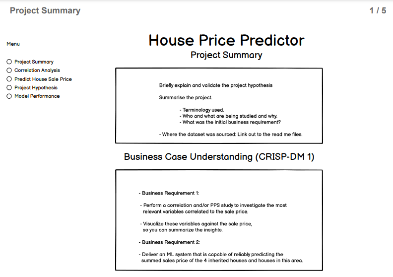
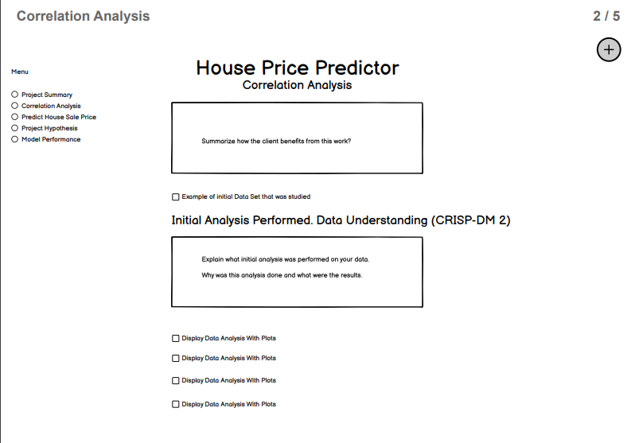
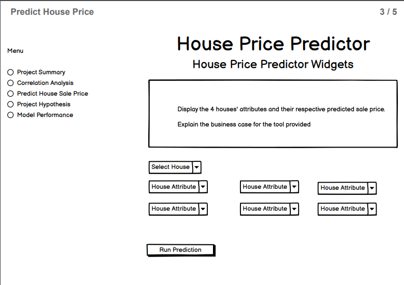
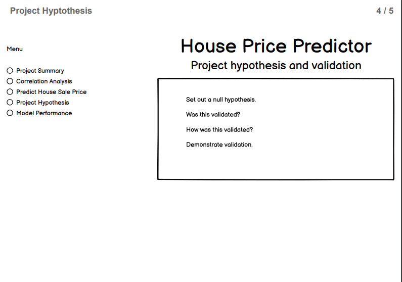
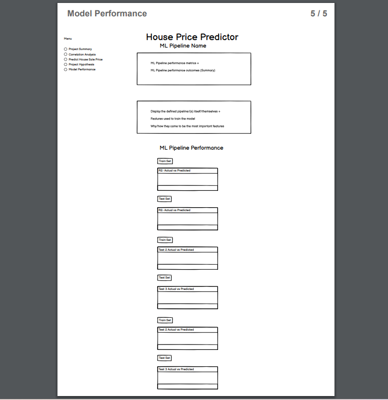

# Housing Heritage Issues.

### Predictive model for the sale of house prices in Ames, Iowa

 - Intended Purpose of This Project:
Complete an intro for this project.

## Table of contents
- <a href="#dc">Dataset Content</a>
- <a href="#br">Business Requirements</a>
- <a href="#hy">Hypothesis and how to validate?</a>
- <a href="#rt">The rationale to map the business requirements to the Data Visualizations and ML tasks</a>
- <a href="#ml">ML Business Case</a>
- <a href="#dd">Dashboard Design</a>
- <a href="#wf">Wireframe of Dashboard</a>
- <a href="#dep">Deployment</a>
- <a href="#tu">Technologies Used</a>
- <a href="#bu">Bugs</a>
- <a href="#cr">Credits</a>

<a href="#intro">Return to table of contents</a>

## Dataset Content

- The dataset for this project is sourced from [Kaggle](https://www.kaggle.com/datasets/codeinstitute/housing-prices-data).

- The features in this dataset are:

    - 1stFlrSF
    - 2ndFlrSF
    - BedroomAbvGr
    - BsmtExposure
    - BsmtFinSF1
    - BsmtFinType1
    - BsmtUnfSF
    - EnclosedPorch
    - GarageArea
    - GarageFinish
    - GarageYrBuilt
    - GrLivArea
    - KitchenQual
    - LotArea
    - LotFrontage
    - MasVnrArea	
    - OpenPorchSF	
    - OverallCond	
    - OverallQual	
    - TotalBsmtSF
    - WoodDeckSF
    - YearBuilt
    - YearRemodAdd

- The Target variable for this project is;

    - **SalePrice**

<a href="#intro">Return to table of contents</a>

## Business Requirements

- A fictional individual, Lydia Doe, has received an inheritance from a deceased great-grandfather.

- Included in the inheritance are four houses located in Ames, Iowa, USA. 

    - Although Lydia has an excellent understanding of property prices in her home country of Belgium
    
    - She fears that basing her estimates for property worth on her current knowledge of the Iowan market might lead to inaccurate appraisals.

    - What makes a house desirable and valuable where she comes from might not be the same in Ames, Iowa.

    - Lydia needs help if she is to maximize the sales price for the inherited properties.

    - She decides to ask a Data Practitioner for help. Her reasons for doing so are:

- A 
    - She doesn't know the worth of the properties and does not want to take the risk of inaccurate pricing estimation, 
        
        since there is potentially a reasonable amount of money to be made or lost when selling the four properties.

- B 
     - She is also interested in predicting the sale price from any house in Ames, Iowa in case of future property ownership in that area.  

- Business Requirement 1:

    - The client is interested in discovering how the house attributes correlate with the sale price.
    
        Therefore, the client expects data visualizations of the correlated variables against the sale price to show that.

- Business Requirement 2:

    - The client is interested in predicting the house sales price from her four inherited houses, and any other house in Ames, Iowa.

<a href="#intro">Return to table of contents</a>

## Hypothesis and how to validate?

- Hypothesis:

    - Overall quality and greater square footage will correlate with the target variable 'SalePrice' more than other features.

- Validation:

- Correlation analysis showing a relationship between the features above and the target 'SalePrice'.

    - Pearsons, Spearmans showing strong linear or monotonic relationships between the features above and the target 'SalePrice'.

- Hypothesis:

    - Few features/components will be required to predict SalePrice.

- Validation:

    - Regression analysis showing which features have more impact on the target over others.
        - Regression Metrics:
            - PCA analysis used to narrow the components which impact variance.
            - R2 (coefficient of determination)
                - 0.8 or above for R2 score on train set, without too much deviation on the test set.
            - Mean Squared Error (MSE), limited deviation between train and test set.
            - Root Mean Squared Error (RMSE), limited deviation between train and test set.
            - Mean Absolute Error (MAE), limited deviation between train and test set.
            

<a href="#intro">Return to table of contents</a>

## The rationale to map the business requirements to the Data Visualizations and ML tasks

- Business Requirement 1:

    - Perform a correlation and/or PPS study to investigate the most relevant variables correlated to the sale price.

    - Visualize these variables against the sale price, so you can summarize the insights.

- Business Requirement 2:

    - Deliver an ML system that is capable of reliably predicting the summed sales price of the 4 inherited houses and houses in this area.

    - Use either conventional ML or Neural Networks to map the relationships between the features and the target.

    - Carry out hyperparameter optimization for the best performing algorithm.

<a href="#intro">Return to table of contents</a>

## ML Business Case

#### Predict house prices in the Ames, Iowa area.

- Regression Model  

    - We want an ML model to: make predictions, for the continuous target variable 'Sale Price', for 4 houses which the client has inherited.
        - It is a supervised, multi-dimensional model.
        - Using PCA analysis, the model used two components to explain 92.05% of the data.
    - Our ideal outcome is: to provide the client with a model that will predict the sale price of her inherited house to within +- 0.05% of the realised sale price.
    - The model success metrics are: 0.8 or above on both the Train and Test sets R2 score.
        - (A) Model failure is to be defined as a model which makes predictions outside of the range specified for acceptable predictions.
        - (B) A model which predicted higher values for smaller houses than for larger houses. It is expected that square footage/area will be a key driver of 'Sale Price'.
    - The output is defined as: Predicted Sale Price. This is a continuous value. 
    - The training data to fit the model comes from: [kaggle.com](https://www.kaggle.com/datasets/codeinstitute/housing-prices-data)
        - This dataset contains: 1460 rows and 24 of data.
        - The cheapest house in the data was 34,900 with the most expensive being 755,000.

<a href="#intro">Return to table of contents</a>

## Dashboard Design for Project 5

**What will the dashboard need to have and what business requirements are being met?**

- Page 1

    - Section 1:

        - Summary Page: 

        - Explain and validate the project hypothesis

        - Summarise the project. 
            - Terminology used.
            - Who and what are being studied and why.
            - What was the initial business requirement?

        - Where the dataset was sourced: Link out to the read me files.

    - Section 2:

        - What were the business requirements for the creation of this dashboard solution? What is it that this ML project is going to solve for the customer?

- Page 2

    - Section 1:
        - A page listing your findings related to which features have the strongest correlation to the house sale price.
            - (Business requirement 1)
        
        - Summarize how does the client benefits from this work?

        - Show sample of data. Show small dataframes of sample data.

        - Document Initial study of the data.
            - This will be an initial correlation analysis of the data.
            - Assess the distribution of certain variables
    - Section 2:

        - Document and explain how each of the correlated variables had an effect on the 'Target' variable.
            - In this case, how certain attributes from the house data i.e. 'features' affected the resulting house price.

        - What techniques were used to understand the data.

        - Show plots of the data analysis and show an understanding of which phase of CRISP_DM this analysis is relavant to. 
            - And how the understanding was arrived at.
        
        - Plots might be bar,scatter,pie,heatmap etc. Analyse the data and see how best to visualize it.

- Page 3: A page displaying the 4 houses' attributes and their respective predicted sale price.

    - Section 1:

        - Display a message informing the summed predicted price for all 4 inherited houses.

        - Add interactive input widgets that allow a user to provide real-time house data to predict the sale price.

        - Quantity of widgets, their content and their functions to be mapped after the data is understood.

    
- Page 4: A page indicating your project hypothesis(es) and how you validated it across the project.

    - Section 1:

        - Predictive Analysis Correlation:

        - Provide a deployed working model that will predict the price of the 4 inherited houses and any inherited houses in the area.

        - ToDo: How will this look? How will this be achieved?

- Page 5:  A technical page displaying your model performance. If you deployed an ML pipeline, you have to display your pipeline steps.

    - Section 1:

        - ML Pipeline performance metrics + ML Pipeline performance outcomes (Summary)

        - The defined pipeline itself + features used to train the model and why/how they came to be the most important ones

        - Document the Performance over the test and train sets

<a href="#intro">Return to table of contents</a>

## Wireframe of Dashboard.

<a href="#intro">Return to table of contents</a>

## Deployment of a Streamlit Application

<a href="#intro">Return to table of contents</a>

## Technologies Used

- Libraries and Packages Used for this Machine Learning Project.

    - Library Name
        - Specific ecample on how this library was used.

    - Library Name
        - Specific ecample on how this library was used.

<a href="#intro">Return to table of contents</a>

## Bugs

- Live Bugs

- Solved Bugs
    - Deployment error:
        - Changed Python version from python-3.8.15 to python-3.8.16 as suggested by Niel_CI to
        
            eliminate the error of Heroku-Stack-22 being incompatible with the python version which was installed after forking the repository. 
         
            Python version: python-3.8.16 is the version used by Heroku-20.

<a href="#intro">Return to table of contents</a>

## Credits

- Credit any external code

- Credit code institute code
